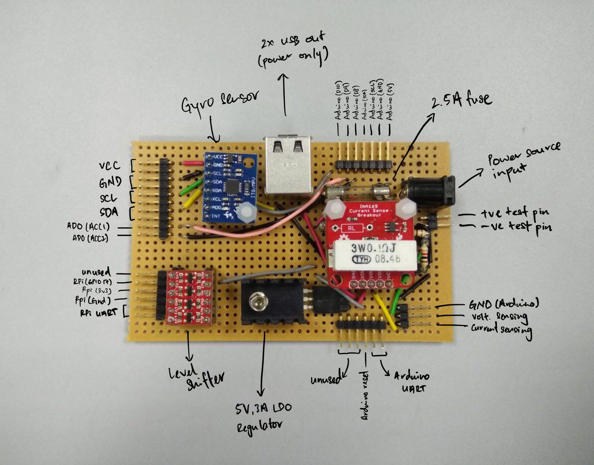
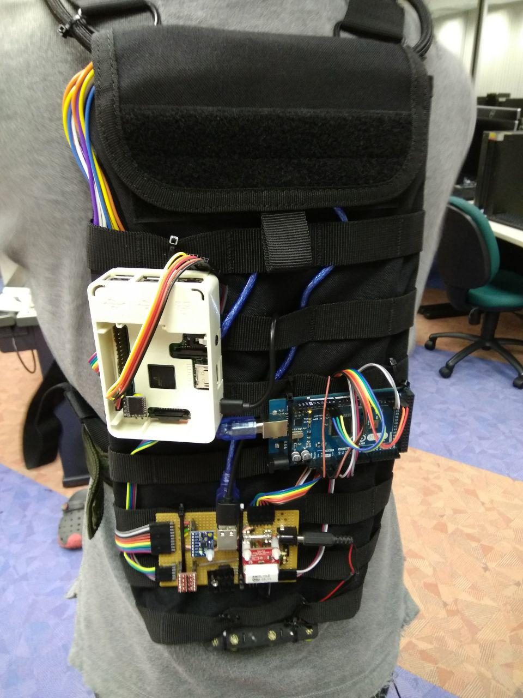

# CG3002 - Embedded Systems Project  
## NUS AY17/18 Sem 1 Group 7  

##### /dance/testing (python codes resides here)  
- main.py - main python script to launch processes  
- mega_pi_integrated.py - pi to arduino serial communication python script (firmware subteam)  
- butterworth.py - software low pass filter script for prediction.py (software subteam)  
- prediction.py - prediction python script (software subteam)
- client.py - socket communication to server (firmware subteam)  
- key - contains key for secure communication between client and server (firmware subteam)  

##### /dance/testing/data (trained model resides here)  
- trained_cnn_model.h5 - Convolutional Neural Network trained model for prediction.py  
- trained_nn_model.h5 - Neural Network trained model for prediction.py  

##### Required python3 libraries  
- numpy  
- pandas  
- keras  
- scipy  
- matplotlib  
- h5py  
- pycryptodome  
- tensorflow
- RPi.GPIO  

##### Power Distribution & IO Hub  
  

##### Embedded System Setup

##### Contributors  
- [Santos](https://github.com/rxmend)  
- [Jerich Chia](https://github.com/JerichChia)  
- [Gil Ki Hyun](https://github.com/gilkihyun)  
- [Rahman](https://github.com/arshrahman)  
- [Lim Yong Zhi](https://github.com/limyz)  
- [Hazmei](https://github.com/hazmei)
